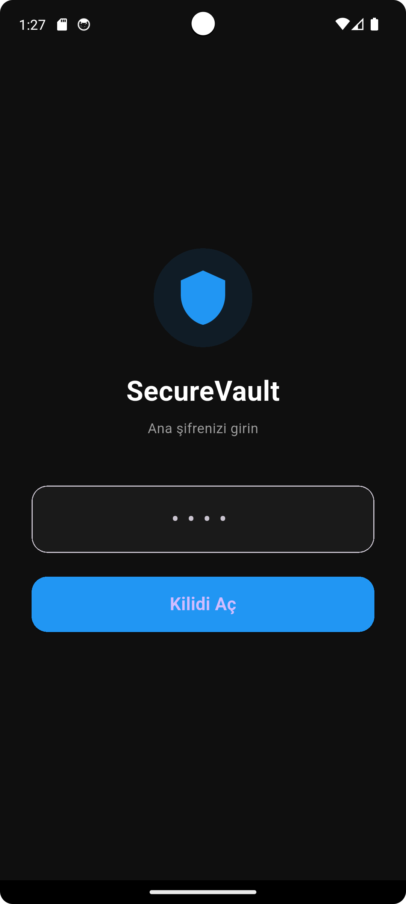
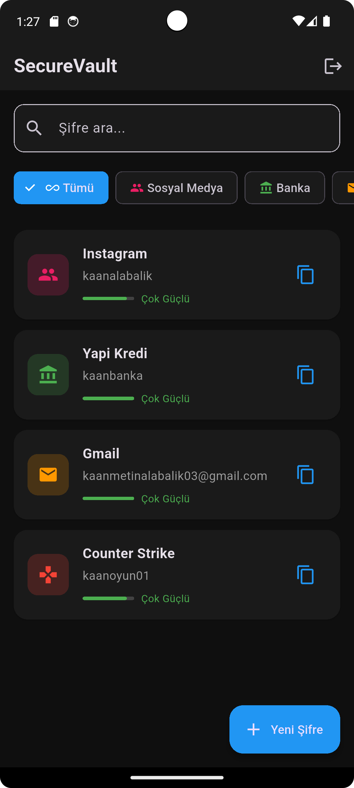

# 🔐 SecureVault

Flutter ile geliştirilmiş güvenli şifre yöneticisi uygulaması.

## 📱 Ekran Görüntüleri

| Giriş Ekranı | Ana Ekran | Şifre Ekleme |
|:---:|:---:|:---:|
|  |  |  |

## ✨ Özellikler

- 🔒 **AES-256 Şifreleme** - Tüm şifreler güvenli şekilde şifrelenir
- 🔑 **Master Password** - Tek şifre ile tüm şifrelerinize erişin
- 📂 **Kategoriler** - Sosyal Medya, Banka, E-posta, Alışveriş, Oyun
- 🔍 **Arama** - Şifreleriniz arasında hızlıca arayın
- 📊 **Şifre Gücü Analizi** - Şifrelerinizin güvenlik seviyesini görün
- 🎲 **Şifre Oluşturucu** - Güçlü rastgele şifreler oluşturun
- 💾 **Kalıcı Depolama** - Verileriniz güvenli şekilde saklanır
- 🌙 **Karanlık Tema** - Göz yormayan modern arayüz

## 🛠️ Teknolojiler

- **Flutter** - Cross-platform framework
- **Dart** - Programlama dili
- **flutter_secure_storage** - Güvenli veri depolama
- **encrypt** - AES-256 şifreleme

## 🚀 Kurulum
```bash
# Repoyu klonla
git clone https://github.com/kaanalabalik/SecureVault.git

# Proje dizinine gir
cd SecureVault

# Bağımlılıkları yükle
flutter pub get

# Uygulamayı çalıştır
flutter run
```

## 📋 Gereksinimler

- Flutter SDK 3.0+
- Dart 3.0+
- Android Studio / VS Code

## 👨‍💻 Geliştirici

**Kaan Alabalık**
- GitHub: [@kaanalabalik](https://github.com/kaanalabalik)
- LinkedIn: [Kaan Alabalık](https://www.linkedin.com/in/kaan-alabalik-180222365/)

## 📄 Lisans

Bu proje MIT lisansı altında lisanslanmıştır.
